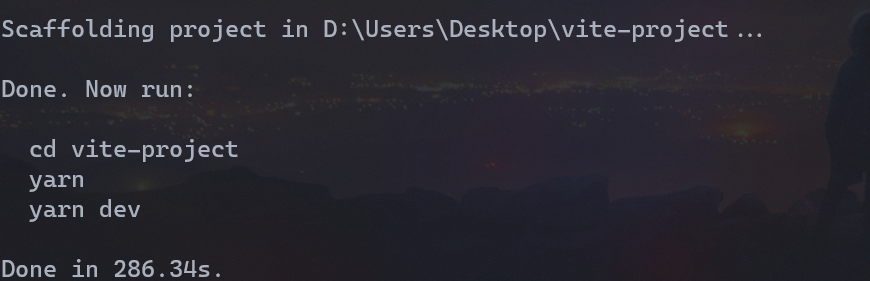
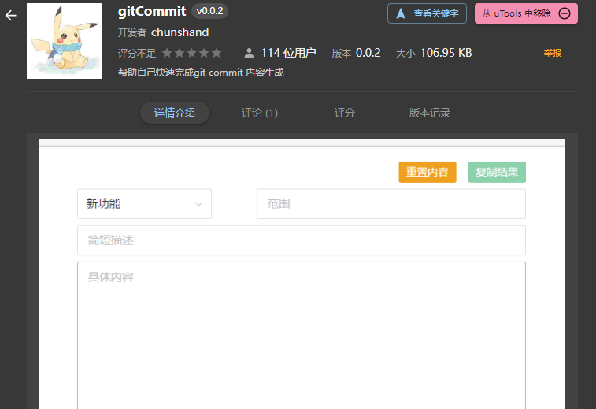

# 从0开始搭建一个Vue3.x项目骨架

## 写在前面

本篇文章将从0开始搭建一个企业可用的项目骨架，这里我使用的包管理工具时Yarn，别问为什么，问就是喜欢用这个；如果你是npm的话，直接将`yarn add`全部替换为`npm i`即可（废话文学）。

## 通过Vite安装Vue3项目

安装比较简单，首先输入命令

```Bash
npm create vite
```


然后会让你输入项目名称


第三步让你选择一个框架，这里选择Vue


最后一步我们选择`vue-ts`，也就是Vue+TypeScript，


然后就创建完毕了，如下图：



## 代码规范

随着团队的不断扩大，每个人都有自己的coding风格，但是如果一个项目中的代码存在多种风格，那对于代码的可维护性和可读性都大大减少，所以说一个项目规范对于前端团队来说的重要性。

### ESlint+Prettier

这两个工具一个是进行代码风格检查，另一个是格式化工具，现在我们开始配置。

第一步，安装相关依赖：

```Bash
yarn add eslint eslint-plugin-vue eslint-define-config --dev # eslink
yarn add prettier eslint-plugin-prettier @vue/eslint-config-prettier --dev# prettire
yarn add @vue/eslint-config-typescript @typescript-eslint/eslint-plugin @typescript-eslint/parser --dev # 对ts的支持
```


第二步，编写对应配置文件

`.eslintrc.js`

```JavaScript
const { defineConfig } = require('eslint-define-config')

module.exports = defineConfig({
  root: true,
  /* 指定如何解析语法。*/
  parser: 'vue-eslint-parser',
  /* 优先级低于parse的语法解析配置 */
  parserOptions: {
    parser: '@typescript-eslint/parser',
    //模块化方案
    sourceType: 'module',
  },
  env: {
    browser: true,
    es2021: true,
    node: true,
    // 解决 defineProps and defineEmits generate no-undef warnings
    'vue/setup-compiler-macros': true,
  },
  // https://eslint.bootcss.com/docs/user-guide/configuring#specifying-globals
  globals: {},
  extends: [
    'plugin:vue/vue3-recommended',
    'eslint:recommended',
    'plugin:@typescript-eslint/recommended', // typescript-eslint推荐规则,
    'prettier',
    'plugin:prettier/recommended',
  ],
  // https://cn.eslint.org/docs/rules/
  rules: {
    // 禁止使用 var
    'no-var': 'error',
    semi: 'off',
    // 优先使用 interface 而不是 type
    '@typescript-eslint/consistent-type-definitions': ['error', 'interface'],
    '@typescript-eslint/no-explicit-any': 'off', // 可以使用 any 类型
    '@typescript-eslint/explicit-module-boundary-types': 'off',
    // 解决使用 require() Require statement not part of import statement. 的问题
    '@typescript-eslint/no-var-requires': 0,
    // https://github.com/typescript-eslint/typescript-eslint/blob/main/packages/eslint-plugin/docs/rules/ban-types.md
    '@typescript-eslint/ban-types': [
      'error',
      {
        types: {
          // add a custom message to help explain why not to use it
          Foo: "Don't use Foo because it is unsafe",

          // add a custom message, AND tell the plugin how to fix it
          String: {
            message: 'Use string instead',
            fixWith: 'string',
          },

          '{}': {
            message: 'Use object instead',
            fixWith: 'object',
          },
        },
      },
    ],
    // 禁止出现未使用的变量
    '@typescript-eslint/no-unused-vars': [
      'error',
      { vars: 'all', args: 'after-used', ignoreRestSiblings: false },
    ],
    'vue/html-indent': 'off',
    // 关闭此规则 使用 prettier 的格式化规则，
    'vue/max-attributes-per-line': ['off'],
    // 优先使用驼峰，element 组件除外
    'vue/component-name-in-template-casing': [
      'error',
      'PascalCase',
      {
        ignores: ['/^el-/', '/^router-/'],
        registeredComponentsOnly: false,
      },
    ],
    // 强制使用驼峰
    camelcase: ['error', { properties: 'always' }],
    // 优先使用 const
    'prefer-const': [
      'error',
      {
        destructuring: 'any',
        ignoreReadBeforeAssign: false,
      },
    ],
  },
})


```


`.eslintignore`

```text
/node_modules/
/public/
.vscode
.idea
```


`.prettierrc`

```JSON
{
  "semi": false,
  "singleQuote": true,
  "printWidth": 80,
  "trailingComma": "all",
  "arrowParens": "avoid",
  "endOfLine": "lf"
}

```


### husky

`husky`是一个Git Hook，可以帮助我们对`commit`前，`push`前以及`commit`提交的信息进行验证，现在我们就来安装并配置一下这个工具，首先通过自动配置命令安装，命令如下：

```Bash
npx husky-init && npm install  # npm
npx husky-init && yarn         # Yarn 1
npx husky-init --yarn2 && yarn # Yarn 2+
```


执行完毕之后会在项目的根目录出现一个`.husky`的目录，目录下有一个`pre-commit`文件，我们将`npm test`修改为我们需要执行的命令，示例代码如下：

```Bash
#!/bin/sh
. "$(dirname "$0")/_/husky.sh"

yarn lint

```


最后我们配置一下`package.json`，示例代码如下：

```JSON
"scripts": {
  "lint": ""lint": "eslint src --fix --ext .js,.ts,.jsx,.tsx,.vue && prettier --write --ignore-unknown""
},
```


- `src`：要验证的目标文件夹；
- `--fix`：自动修复命令；
- `--ext`：指定检测文件的后缀。

现在我们进行`commit`之前会对代码进行检测并进行格式化。

### lint-staged

我们配置好了`husky`后，会出现一个问题，就是我们不管是改动一行还是两行都会对整个项目进行代码检查和格式化，我们可以通过lint-staged这个工具来实现只对git暂存区中的内容进行检查和格式化，配置步骤如下：

第一步，安装lint-staged

```Bash
yarn add lint-staged --dev
```


第二步，配置`package.json`

```JSON
{
  "scripts": {},
  // 新增
  "lint-staged": {
    "*.{vue,js,ts,tsx,jsx}": [
      "eslint --fix",
      "prettier --write --ignore-unknown"
    ]
  },
}

```


第三步，修改`.husky/pre-commit`，修改内容如下：

```Bash
#!/bin/sh
. "$(dirname "$0")/_/husky.sh"

npx lint-staged

```


到这就配置完成了。

### commit message 规范

优秀项目中commit message都是统一风格的，这样做的好处就是可以快速定位每次提交的内容，方便之后对版本进行控制。现在我们就来配置一下commit message 规范。

#### 提交规范

1. 安装[commitizen](https://www.npmjs.com/package/commitizen)
	```Bash
	yarn add commitizen --dev
	```
	
2. 配置项目提交说明，这里我们使用[cz-conventional-changelog](https://github.com/commitizen/cz-conventional-changelog)，或者选择[cz-customizable](https://github.com/leoforfree/cz-customizable)，我们先进行安装
	```Bash
	yarn add cz-conventional-changelog --dev
	```
	
3. 修改`package.json`，代码如下：
	```JSON
	"config": {
	  "commitizen": {
	    "path": "./node_modules/cz-conventional-changelog"
	  }
	}
	```
	
4. 进行`commit`，通过`cz`这个cli工具
	```Bash
	yarn cz # 或者 npx cz
	```
	
	第一步选择本次更新的类型，每个类型的作用如下表所示：
	|Type|作用|
	|---|---|
	|feat|新增特性|
	|fix|修复 Bug|
	|docs|修改文档|
	|style|代码格式修改|
	|refactor|代码重构|
	|perf|改善性能|
	|test|测试|
	|build|变更项目构建或外部依赖（例如 scopes: webpack、gulp、npm等）|
	|ci|更改持续集成软件的配置文件和`package.json`中的`scripts`命令|
	|chore|变更构建流程或辅助工具(比如更改测试环境)|
	|revert|代码回退|
	
	
	第二步填写改变的作用域，可以写组件名或者文件名
	第三步填写提交的信息
	第四步填写提交的详细描述
	第五步选择是否是一次重大的更改
	第六步是否影响某个open issue
	整个过程如下图
	
5. 我们也可以配置一个`script`，示例代码如下：
	`package.json`
	```JSON
	"scripts": {
	  "commit": "cz"
	},
	```
	
	配置完成后我们可以通过`yarn commit`的方式提交代码了。

#### utools插件

如果有同学在使用utools的话，这里推荐一个utools插件，是关系不错的一个大哥写的，他的[掘金](https://juejin.cn/user/114004937933352)（看不看没啥区别），utools插件如下：



这一版还加了一个快捷键复制的操作，原因如下：


大哥能处，有需求真的写啊。

#### VScode插件

使用命令行提交可能对于某些同学来说不是很友好，这里推荐一个Vscode插件（[Visual Studio Code Commitizen Support](https://marketplace.visualstudio.com/items?itemName=KnisterPeter.vscode-commitizen)），可以通过图形化的方式进行操作。

操作流程非常简单，安装之后在【源代码管理】面板点击蓝色的icon，如下图


然后就跟着操作即可，完成之后会自动commit。

另一个插件[Commit Message Editor](https://marketplace.visualstudio.com/items?itemName=adam-bender.commit-message-editor)也比较不错，是图形化界面的，存在表单和文本框两种模式。

#### message验证

现在我们定义了提交规范，但是并不能阻止不按照这个规范进行提交，这里我们通过`commitlint`配合`husky`来实现对提交信息的验证规则。

第一步，安装相关依赖

```Bash
yarn add @commitlint/config-conventional @commitlint/cli --dev
```


第二步，创建`commitlint.config.js`配置commitlint

```JavaScript
module.exports = {
  extends: ['@commitlint/config-conventional'],
}

```


> 更多配置项可以参考[官方文档](https://commitlint.js.org/#/reference-configuration)


第三步，使用`husky`生成`commit-msg`文件，验证提交信息

```Bash
yarn husky add .husky/commit-msg "npx --no-install commitlint --edit $1"
```


到这，commitlint的配置就完成了，如果message编写不规范，则会阻止提交。

## 配置Vite

Vite是尤大开源的一款打包工具，目前已经在两个项目中使用了Vite，总体感觉还不错，开发环境下真的超快，唯一的不足我觉得是HMR吧，体验并不是很好。

这里我介绍一下一个基础配置：

### 别名配置

配置别名可以帮助我们快速的找到我们想要的组件、图片等内容，不用使用`../../../`的方式，首先配置`vite.config.ts`，通过`resolve.alias`的方式配置，示例代码如下：

```TypeScript
import { resolve } from 'path'

export default defineConfig(({ mode }: ConfigEnv) => {
  return {
    resolve: {
      alias: {
        '@': resolve(__dirname, 'src'),
        cpns: resolve(__dirname, 'src/components'),
      },
      extensions: ['.js', '.json', '.ts', '.vue'], // 使用路径别名时想要省略的后缀名，可以自己 增减
    },
    /* more config */
  }
})

```


这里配置两个两个别名，分别是`@`和`cpns`，然后配置`tsconfig.json`，允许别名在使用，代码如下：

```JSON
"compilerOptions": {
  // 用于设置解析非相对模块名称的基本目录，相对模块不会受到baseUrl的影响
  "baseUrl": ".",
  "paths": {
    // 用于设置模块名到基于baseUrl的路径映射
    "/@/*": [ "src/*" ],
    "/cpns/*": [ "src/components/*" ]
  }
},
```


### 环境变量

#### .env文件

在Vite中通过.env开头的文件去读取配置，来作为环境变量，Vite默认允许我们使用以下文件：

```Bash
.env                # 所有情况下都会加载
.env.local          # 所有情况下都会加载，但会被 git 忽略
.env.[mode]         # 只在指定模式下加载
.env.[mode].local   # 只在指定模式下加载，但会被 git 忽略
```


这些文件是有优先级的，他们的优先级是`.env`<`.env.local`<`.env.[mode]`<`.env.[mode].local`；Vite中还预设了一些环境变量，这些的优先级是最高的，不会被覆盖，分别如下：

- `MODE: {string}`：应用运行的模式（开发环境下为`development`，生成环境为`production`）。
- `BASE_URL: {string}`：部署应用时的基本 URL。他由`base` 配置项决定。
- `PROD: {boolean}`：当前是否是生产环境。
- `DEV: {boolean}`：当前是否是开发环境 (永远与 `PROD`相反)。

这些环境变量Vite允许我们通过`import.meto.env`方式获取。

#### 定义环境变量

如果我么你想要自定义环境变量，就必须以`VITE_`开头，如果修改则需要通过[`envPrefix`](https://cn.vitejs.dev/config/index.html#envprefix)[配置项](https://cn.vitejs.dev/config/index.html#envprefix)，该配置项允许我们传入一个非空的字符串作为变量的前置。

`.env`

```Bash
VITE_APP_API_BASE_URL=http://127.0.0.1:8080/
```


定义完成之后我们就可以在项目中通过`import.meta.env.VITE_APP_API_BASE_URL`的方式获取。

如果想要获得TypeScript的类型提示，需要在创建一个`src/env.d.ts`，示例代码如下：

```TypeScript
/// <reference types="vite/client" />

interface ImportMetaEnv {
  readonly VITE_APP_API_BASE_URL: string
  // 定义更多环境变量
}

interface ImportMeta {
  readonly env: ImportMetaEnv
}

declare module '*.vue' {
  import type { DefineComponent } from 'vue'
  // eslint-disable-next-line @typescript-eslint/no-explicit-any, @typescript-eslint/ban-types
  const component: DefineComponent<{}, {}, any>
  export default component
}

```


在使用时就会获得智能提示。

#### 在vite.config.ts中获取环境变量

如果我们想要在`vite.config.ts`中获取环境变量，需要使用Vite提供的`loadEnv()`方法，该方法的定义如下：

```TypeScript
function loadEnv(
  mode: string, 
  envDir: string, 
  prefixes?: string | string[]
): Record<string, string>
```


上面的三个参数的解释如下：

- `mode`：模式；
- `envDir`：环境变量配置文件所在目录；
- `prefixes`：【可选】接受的环境变量前缀，默认为`VITE_`。

了解了使用的API，在`vite.config.ts`中获取环境变量示例代码如下：

```TypeScript
import { defineConfig, loadEnv } from 'vite'
import vue from '@vitejs/plugin-vue'
import AutoImport from 'unplugin-auto-import/vite'
import Components from 'unplugin-vue-components/vite'
import { ElementPlusResolver } from 'unplugin-vue-components/resolvers'
import type { ConfigEnv } from 'vite'

// https://vitejs.dev/config/
export default defineConfig(({ mode }: ConfigEnv) => {
  const env = loadEnv(mode, process.cwd())
  return {
    /* more config */
    server: {
      proxy: {
        '/api': {
          target: env.VITE_APP_API_BASE_URL,
          changeOrigin: true,
          rewrite: path => path.replace(/^\/api/, ''),
        },
      },
    },
  }
})


```


## 项目依赖

### 安装Element-plus

1. 安装Element-plus
	```Bash
	yarn add element-plus
	```
	
2. Volar 支持
	如果您使用 Volar，请在 `tsconfig.json` 中通过 `compilerOptions.type` 指定全局组件类型。
	```JSON
	// tsconfig.json
	{
	  "compilerOptions": {
	    // ...
	    "types": ["element-plus/global"]
	  }
	}
	```
	
3. 按需导入
	安装相关插件实现自动按需导入
	```Bash
	yarn add unplugin-vue-components unplugin-auto-import --dev
	```
	
	`vite.config.js`
	```JavaScript
	import AutoImport from 'unplugin-auto-import/vite'
	import Components from 'unplugin-vue-components/vite'
	import { ElementPlusResolver } from 'unplugin-vue-components/resolvers'
	
	export default {
	  plugins: [
	    // ...
	    AutoImport({
	      resolvers: [ElementPlusResolver()],
	    }),
	    Components({
	      resolvers: [ElementPlusResolver()],
	    }),
	  ],
	}
	```
	

### Tailwind CSS

1. 安装
	```Bash
	yarn add tailwindcss postcss autoprefixer --dev
	```
	
2. 初始化
	```Bash
	yarn tailwindcss init -p
	```
	
3. 配置`tailwind.config.js`
	```JavaScript
	module.exports = {
	  content: ['./index.html', './src/**/*.{vue,js,ts,jsx,tsx}'],
	  theme: {
	    extend: {},
	  },
	  plugins: [],
	  // tree shaking
	  purge: [
	    './src/**/*.html',
	    './src/**/*.vue',
	    './src/**/*.jsx',
	    './src/**/*.tsx',
	  ],
	}
	
	```
	
4. 配置`postcss.config.js`
	```JavaScript
	module.exports = {
	  plugins: {
	    tailwindcss: {},
	    autoprefixer: {},
	  },
	}
	```
	
5. 引入Tailwind CSS
	`./src/index.css`
	```CSS
	@tailwind base;
	@tailwind components;
	@tailwind utilities;
	```
	
	`./src/main.ts`
	```JavaScript
	import { createApp } from 'vue'
	import App from './App.vue'
	import './index.css'
	createApp(App).mount('#app')
	
	```
	

### VueRouter

第一步，安装VueRouter

```Bash
yarn add vue-router@next
```


第二步，创建VueRouter入口文件

`src/router/index.ts`

```TypeScript
import { createRouter, createWebHistory } from 'vue-router'
import type { RouteRecordRaw } from 'vue-router'

// 配置路由信息
const routes: RouteRecordRaw[] = []

const router = createRouter({
  routes,
  history: createWebHistory(),
})

export default router

```


第三步，在`main.ts`中引入VueRouter

```TypeScript
import { createApp } from 'vue'
import App from './App.vue'
// 引入 vue-router
import router from './router'
import './assets/css/index.css'

createApp(App).use(router).mount('#app')

```


### pinia

第一步，安装pinia

```Bash
yarn add vuex@next
```


第二步，创建vuex入口文件

`src/store/index.ts`

```TypeScript
import { createPinia } from 'pinia'

const store = createPinia()

export default store

```


第三步，在`main.ts`中引入pinia

```TypeScript
import { createApp } from 'vue'
import App from './App.vue'
// 引入 vue-router
import router from './router'
// 引入 vuex
import store from './store'
import './assets/css/index.css'

createApp(App).use(router).use(store).mount('#app')

```


第四步，创建测试数据

`src/store/modules/count.ts`

```TypeScript
import { defineStore } from 'pinia'
import type { CountInterface } from './types'
export const useCountStore = defineStore({
  id: 'count', // id必填，且需要唯一
  // state
  state: (): CountInterface => {
    return {
      count: 0,
    }
  },
  // getters
  getters: {
    doubleCount: state => {
      return state.count * 2
    },
  },
  // actions
  actions: {
    // actions 同样支持异步写法
    countAdd() {
      // 可以通过 this 访问 state 中的内容
      this.count++
    },
    countReduce() {
      this.count--
    },
  },
})

```


`src/store/modules/type.ts`

```TypeScript
export interface CountInterface {
  count: number
}

```


最后一步，为了方便导入，我们将所有内容统一在`src/store/index.ts`进行导入导出，代码如下：

```TypeScript
import { createPinia } from 'pinia'
import { useCountStore } from './modules/count'
const store = createPinia()

export default store
export { useCountStore }

```


测试代码如下：

```HTML
<template>
  <div class="index">
    <span>当前数值{{ countComputed }}</span>
    <br />
    <span>双倍数值{{ doubleCount }}</span>
    <br />
    <el-button type="primary" size="default" @click="countStore.countAdd">
      +1
    </el-button>
    <el-button type="primary" size="default" @click="countStore.countAdd">
      -1
    </el-button>
  </div>
</template>
<script setup lang="ts">
import { computed } from 'vue'
import { useCountStore } from '/@/store'
import { storeToRefs } from 'pinia'
const countStore = useCountStore()
// 通过计算属性
const countComputed = computed(() => countStore.count)
// 通过 storeToRefs api 结构
const { doubleCount } = storeToRefs(countStore)
</script>
<style scoped></style>

```


### 封装Axios

Axios作为前端使用最高的HTTP请求库，周下载量已经达到了2000多万，在这个项目中我们也使用Axios，这里我们通过TS对Axios进行二次封装，方便我们在项目中使用。

这一块封装过程比较复杂，过程参考我的上一篇文章，[点我跳转](https://juejin.cn/post/7071518211392405541)；完整代码如下：

`src\service\index.ts`

```TypeScript
import Request from './request'

import type { RequestConfig } from './request/types'
interface YWZRequestConfig<T> extends RequestConfig {
  data?: T
}
interface YWZResponse<T> {
  statusCode: number
  desc: string
  result: T
}

const request = new Request({
  baseURL: import.meta.env.BASE_URL,
  timeout: 1000 * 60 * 5,
  interceptors: {
    // 请求拦截器
    requestInterceptors: config => config,
    // 响应拦截器
    responseInterceptors: result => result,
  },
})

/**
 * @description: 函数的描述
 * @interface D 请求参数的interface
 * @interface T 响应结构的intercept
 * @param {YWZRequestConfig} config 不管是GET还是POST请求都使用data
 * @returns {Promise}
 */
const ywzRequest = <D, T = any>(config: YWZRequestConfig<D>) => {
  const { method = 'GET' } = config
  if (method === 'get' || method === 'GET') {
    config.params = config.data
  }
  return request.request<YWZResponse<T>>(config)
}
// 取消请求
export const cancelRequest = (url: string | string[]) => {
  return request.cancelRequest(url)
}
// 取消全部请求
export const cancelAllRequest = () => {
  return request.cancelAllRequest()
}

export default ywzRequest

```


`src\service\request\index.ts`

```TypeScript
import axios, { AxiosResponse } from 'axios'
import type { AxiosInstance, AxiosRequestConfig } from 'axios'
import type {
  RequestConfig,
  RequestInterceptors,
  CancelRequestSource,
} from './types'

class Request {
  // axios 实例
  instance: AxiosInstance
  // 拦截器对象
  interceptorsObj?: RequestInterceptors

  /*
  存放取消方法的集合
  * 在创建请求后将取消请求方法 push 到该集合中
  * 封装一个方法，可以取消请求，传入 url: string|string[]  
  * 在请求之前判断同一URL是否存在，如果存在就取消请求
  */
  cancelRequestSourceList?: CancelRequestSource[]
  /*
  存放所有请求URL的集合
  * 请求之前需要将url push到该集合中
  * 请求完毕后将url从集合中删除
  * 添加在发送请求之前完成，删除在响应之后删除
  */
  requestUrlList?: string[]

  constructor(config: RequestConfig) {
    this.requestUrlList = []
    this.cancelRequestSourceList = []
    this.instance = axios.create(config)
    this.interceptorsObj = config.interceptors
    // 拦截器执行顺序 接口请求 -> 实例请求 -> 全局请求 -> 实例响应 -> 全局响应 -> 接口响应
    this.instance.interceptors.request.use(
      (res: AxiosRequestConfig) => res,
      (err: any) => err,
    )

    // 使用实例拦截器
    this.instance.interceptors.request.use(
      this.interceptorsObj?.requestInterceptors,
      this.interceptorsObj?.requestInterceptorsCatch,
    )
    this.instance.interceptors.response.use(
      this.interceptorsObj?.responseInterceptors,
      this.interceptorsObj?.responseInterceptorsCatch,
    )
    // 全局响应拦截器保证最后执行
    this.instance.interceptors.response.use(
      // 因为我们接口的数据都在res.data下，所以我们直接返回res.data
      (res: AxiosResponse) => {
        return res.data
      },
      (err: any) => err,
    )
  }
  /**
   * @description: 获取指定 url 在 cancelRequestSourceList 中的索引
   * @param {string} url
   * @returns {number} 索引位置
   */
  private getSourceIndex(url: string): number {
    return this.cancelRequestSourceList?.findIndex(
      (item: CancelRequestSource) => {
        return Object.keys(item)[0] === url
      },
    ) as number
  }
  /**
   * @description: 删除 requestUrlList 和 cancelRequestSourceList
   * @param {string} url
   * @returns {*}
   */
  private delUrl(url: string) {
    const urlIndex = this.requestUrlList?.findIndex(u => u === url)
    const sourceIndex = this.getSourceIndex(url)
    // 删除url和cancel方法
    urlIndex !== -1 && this.requestUrlList?.splice(urlIndex as number, 1)
    sourceIndex !== -1 &&
      this.cancelRequestSourceList?.splice(sourceIndex as number, 1)
  }
  request<T>(config: RequestConfig): Promise<T> {
    return new Promise((resolve, reject) => {
      // 如果我们为单个请求设置拦截器，这里使用单个请求的拦截器
      if (config.interceptors?.requestInterceptors) {
        config = config.interceptors.requestInterceptors(config)
      }
      const url = config.url
      // url存在保存取消请求方法和当前请求url
      if (url) {
        this.requestUrlList?.push(url)
        config.cancelToken = new axios.CancelToken(c => {
          this.cancelRequestSourceList?.push({
            [url]: c,
          })
        })
      }
      this.instance
        .request<any, T>(config)
        .then(res => {
          // 如果我们为单个响应设置拦截器，这里使用单个响应的拦截器
          if (config.interceptors?.responseInterceptors) {
            res = config.interceptors.responseInterceptors<T>(res)
          }

          resolve(res)
        })
        .catch((err: any) => {
          reject(err)
        })
        .finally(() => {
          url && this.delUrl(url)
        })
    })
  }
  // 取消请求
  cancelRequest(url: string | string[]) {
    if (typeof url === 'string') {
      // 取消单个请求
      const sourceIndex = this.getSourceIndex(url)
      sourceIndex >= 0 && this.cancelRequestSourceList?.[sourceIndex][url]()
    } else {
      // 存在多个需要取消请求的地址
      url.forEach(u => {
        const sourceIndex = this.getSourceIndex(u)
        sourceIndex >= 0 && this.cancelRequestSourceList?.[sourceIndex][u]()
      })
    }
  }
  // 取消全部请求
  cancelAllRequest() {
    this.cancelRequestSourceList?.forEach(source => {
      const key = Object.keys(source)[0]
      source[key]()
    })
  }
}

export default Request
export { RequestConfig, RequestInterceptors }

```


`src\service\request\types.ts`

```TypeScript
import type { AxiosRequestConfig, AxiosResponse } from 'axios'
export interface RequestInterceptors {
  // 请求拦截
  requestInterceptors?: (config: AxiosRequestConfig) => AxiosRequestConfig
  requestInterceptorsCatch?: (err: any) => any
  // 响应拦截
  responseInterceptors?: <T = AxiosResponse>(config: T) => T
  responseInterceptorsCatch?: (err: any) => any
}
// 自定义传入的参数
export interface RequestConfig extends AxiosRequestConfig {
  interceptors?: RequestInterceptors
}
export interface CancelRequestSource {
  [index: string]: () => void
}

```


`src\api\index.ts`

```TypeScript
import request from '/@/service'
interface Req {
  apiKey: string
  area?: string
  areaID?: string
}
interface Res {
  area: string
  areaCode: string
  areaid: string
  dayList: any[]
}
export const get15DaysWeatherByArea = (data: Req) => {
  return request<Req, Res>({
    url: '/api/common/weather/get15DaysWeatherByArea',
    method: 'GET',
    data,
    interceptors: {
      requestInterceptors(res) {
        return res
      },
      responseInterceptors(result) {
        return result
      },
    },
  })
}

```


## 写在最后

到这为止，项目的基础骨架就已经搭建完毕了，后期根据项目需求可动态添加依赖。

项目模板已在[Github](https://github.com/ywanzhou/vue3-template)开源，点个Star给我增加动力~


