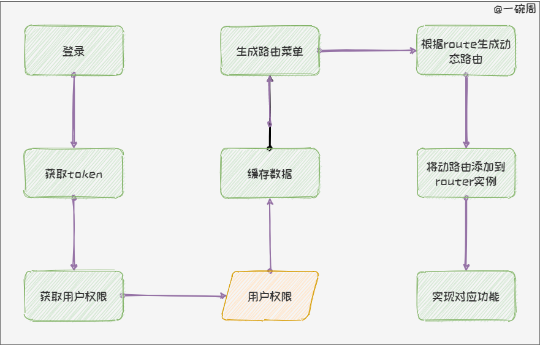
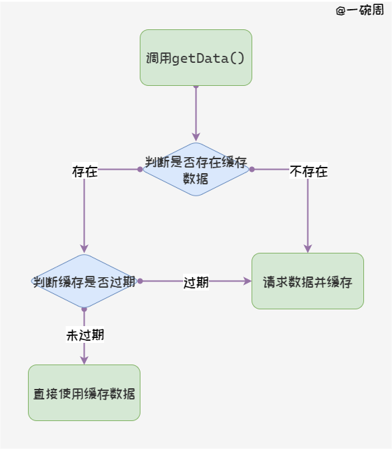
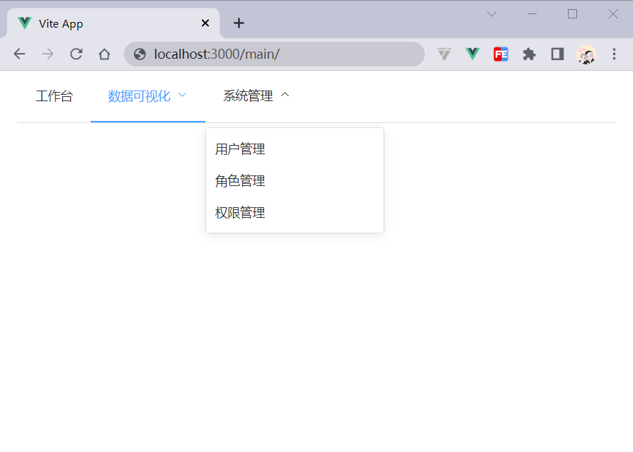

# 动态权限路由

## 目录

*   [🍇 写在前面](#-写在前面)

*   [🍈 实现思路](#-实现思路)

*   [🍉 数据库设计](#-数据库设计)

*   [🍊 mock数据](#-mock数据)

    *   [🍋 请求数据](#-请求数据)

*   [🍍 使用pinia保存数据](#-使用pinia保存数据)

*   [🍌 动态路由实现](#-动态路由实现)

    *   [🥭 实现动态菜单](#-实现动态菜单)

    *   [🍎 使用plop生成同类型的文件](#-使用plop生成同类型的文件)

    *   [🍑 动态添加路由](#-动态添加路由)

*   [🍒 看一下效果](#-看一下效果)

*   [写在最后](#写在最后)

## 🍇 写在前面

任何一个管理系统**几乎都存在**权限管理和动态路由，它一般和用户管理一同出现，可能有的人觉得这个东西每个管理系统都存在，觉得这个模块没有这么的重要；而在我的认知里，像**权限控制和用户管理是管理系统中最重要的一部分**，它是整个管理系统中最基础的部分，只有这部分完善了，其他模块才可以非常顺利的进行开发。

本篇文章通过文字+图片+动图演示的形式介绍了一个最基本的**动态权限路由**实现思路以及实现过程，阅读这篇文章你可能会收获：

1.  用户管理部分的E-R图；

2.  通过`plop`脚手架快速创建同类型文件；

3.  `pinia`如何使用；

4.  如何使用`mock`；

5.  如何**编写动态权限路由**；

> PS：数据来源于mock、前端框架是Vue3、状态管理是Pinia、UI框架是ElementPlus。

## 🍈 实现思路

为了方便理解，我这里画了一张图，如下：



现在我们来详细讲解一下思路：

1.  用户登录获取用户id或者token；

2.  根据token或者用户id去获取用户对应的权限；

3.  获取到用户权限后进行缓存，并存储到`pinia`中；

4.  根据获取的用户权限生成对应的菜单；

5.  根据编写好的route结合用户权限生成对应的router，并通过addRoute添加到路由实例中。

## 🍉 数据库设计

想要实现动态路由，最好的方式是通过后端配合实现，这里讲解一下数据库如何设计，先来看一下E-R图：


这里是最简单的一个版本，你可以根据这个E-R图进行扩展。

根据E-R图可以得知的数据库表如下：

*   用户表

*   角色表

*   权限表

*   角色权限表

其中，角色条件表中的地址，对应`Route`中的`path`选项（你也可以换一个字段，总之就是**需要权限表中存在一个字段与**\*\*\*\***中相对应**）。

**我们还可以将路由的**\*\*****配置在权限表中，比如****\*\*\*\*、\*\*\*\*\*\***等信息。**

用户和角色是一对多的关系，也就是说一个用户只有一个角色，也可以根据你的系统进行调整为多对多，无非就是增加一个中间表而已。

## 🍊 mock数据

如果你有后端的话，这一步就可以直接跳过了，这里我为了演示模拟了一些数据。

首先安装依赖

```bash
npm i vite-plugin-mock
```

第二步在`vite.config.ts`中只用这个插件，示例代码如下：

```typescript
import { viteMockServe } from 'vite-plugin-mock'

export default defineConfig(({ mode }: ConfigEnv) => {
  return {
    plugins: [
      // 配置mock
      viteMockServe({
        mockPath: '/mock',
        localEnabled: true,
      }),
    ],
  }
})

```

然后自己造一些假数据，可以参考[我模拟的数据](https://github.com/ywanzhou/vue3-template/blob/master/mock/data.ts "我模拟的数据")，然后编写一些假的接口，如下代码展示了如何编写一个接口：

```typescript
const mockList: MockMethod[] = [
  {
    url: '/mock/login',
    method: 'post', // 请求方式
    statusCode: 200, // 返回的http状态码
    response: opt => { // opt 对象中包含 url  body  query  headers
      return {
        // 返回的结果集
        statusCode: 200,
        desc: '登录成功',
        result: {
          name: '一碗周',
        },
      }
    },
  },
]
export default mockList
```

我伪造的接口可以参考[GitHub](https://github.com/ywanzhou/vue3-template/blob/master/mock/index.ts "GitHub")。

### 🍋 请求数据

请求数据我使用之前[封装](https://juejin.cn/post/7071518211392405541 "封装")[axios](https://juejin.cn/post/7071518211392405541 "axios")，示例代码如下：

```typescript
import request from '/@/service'
import type {
  IPermissionList,
  IRoleList,
  IUserDetail,
  IUserList,
} from './types/mock'
/* more request */
export const getUserDetail = (data: { id: any }) => {
  return request<any, IUserDetail>({
    url: '/mock/getUserDetail',
    method: 'get',
    data,
  })
}

```

## 🍍 使用pinia保存数据

我在这里就不多说pinia是什么了，简而言之这个🍍就是Vuex5，基本使用可以参考[这里](https://juejin.cn/post/7074885076823048223#heading-21 "这里")。

如下代码展示了如何在`pinia`中获取数据：

```typescript
import { defineStore } from 'pinia'
// 获取路由实例
import router from '/@/router'
import {
  getPermissionList,
  getRoleList,
  getUserDetail,
  getUserList,
} from '/@/api/mock'
import type { IUser } from './types'

export const useUserStore = defineStore({
  id: 'user', // id必填，且需要唯一
  // state
  state: (): IUser => {
    return {
      permissionList: [],
      roleList: [],
      userList: [],
      userDetail: undefined,
    }
  },
  // getters
  getters: {
    menuList: state => {
      return state.userDetail?.permissionList
    },
  },
  // actions
  actions: {
    async getData() {
      this.userList = (await getUserList()).result
      this.permissionList = (await getPermissionList()).result
      this.roleList = (await getRoleList()).result
      this.userDetail = (await getUserDetail({ id: this.curId })).result
      // TODO 动态添加路由
    },
  },
})

```

可以根据需要决定是否进行数据的缓存，如果缓存下次可以直接从缓存中获取，流程图如下：



## 🍌 动态路由实现

### 🥭 实现动态菜单

我在`getUserDetail`接口中返回了该用户的菜单，它的类型定义如下：

```typescript
export interface IPermissionList {
  id: number
  // 菜单名称
  name: string
  // 菜单类型 1表示一级菜单、2表示二级菜单
  type: number
  // 父级
  pid?: number
  // 地址栏的路径，与route中的path对应，从而找到组件
  path: string
}
interface PermissionList extends IPermissionList {
  children: IPermissionList[]
}
export interface IUserDetail extends IUserList {
  // 权限列表
  permissionList: PermissionList[]
}
interface IUserRole {
  roleId: number
  name: string
}
export interface IUserList {
  id: number
  name: string
  role: IUserRole
  createTime: string
  updateTime: string
}

```

我们在`pinia`中编写了一个`getters`获取了菜单的配置，直接使用就好，实现代码如下：

```vue
<script lang="ts" setup>
import { useUserStore } from '/@/store'
const activeIndex = computed(() => {
  return useRoute().path
})
const menuList = computed(() => {
  return useUserStore().menuList
})
</script>
<template>
  <el-menu
    :default-active="activeIndex"
    class="el-menu-demo"
    router
    mode="horizontal"
  >
    <template v-for="menu in menuList" :key="menu.id">
      <!-- 没有子路由的情况 -->
      <el-menu-item v-if="!menu.children" :index="'/main' + menu.path">
        <span>{{ menu.name }}</span>
      </el-menu-item>

      <!-- 存在子路由的情况 -->
      <el-sub-menu v-else :index="'/main' + menu.path">
        <template #title>{{ menu.name }}</template>
        <el-menu-item
          v-for="_menu in menu.children"
          :key="_menu.id"
          :index="'/main' + _menu.path"
          >{{ _menu.name }}</el-menu-item
        >
      </el-sub-menu>
    </template>
  </el-menu>
</template>

```

最终如下图所示：



### 🍎 使用plop生成同类型的文件

当我们创建一个路由时，需要编写很多重复易错的代码，且这些代码没有任何含量，除了`path`和一些`meat`属性都是一样的。

这个时候我们就可以使用`plop`这款脚手架来创建同类型的文件，这个脚手架使用也比较简单，如下所示：

首先我们将Plop作为一个npm模块进行安装，命令如下：

```powershell
npm i plop --dev
```

第二步，创建项目的根目录创建入口文件，文件名为`plopfile.js`，然后写入如下代码：

```javascript
// Plop工作的入口文件，需要导出一个函数
// 此函数接收一个 plop 对象，用于创建生成器任务
export default function (plop) {
    // setGenerator方法接受两个参数，第一个参数作为生成器的名字，第二个参数是生成器的一些配置选项
    plop.setGenerator('main', {
    description: '创建新的路由以及组件',
    // 在命令行看到交互信息
    prompts: [
      {
        type: 'input',
        name: 'pathName',
        message: 'component path:',
      },
      {
        type: 'input',
        name: 'urlName',
        message: 'url:',
      },
      {
        type: 'input',
        name: 'componentName',
        message: 'component name:',
      },
    ],
    // 在命令行中执行的动作，数组中的每一个对象表示一个任务
    actions: [
      {
        // type 为 add 表示添加文件
        type: 'add',
        path: 'src/views/main/{{pathName}}/{{componentName}}.vue',
        templateFile: 'plop-templates/main/vue.hbs',
      },
      {
        type: 'add',
        path: 'src/router/main/{{urlName}}/index.ts',
        // 指定模板文件
        templateFile: 'plop-templates/main/router.hbs',
      },
    ],
  })
}


```

Plop中使用是[Handlebars](https://handlebarsjs.com/ "Handlebars")模板引擎，所以支持插槽的模式。`pathName`表示我们上面输入的那个`name`。

然后就是创建我们的模板文件，通常在根目录下创建`plop-templates`文件夹，然后写入相应的模板文件，示例代码如下：

`vue.hbs`

```hbs
<script setup lang="ts"></script>

<template>
  <div>{{ componentName }}</div>
</template>

<style scoped></style>


```

`router.hbs`

```html
const router = { name: '{{componentName}}', path: '/main/{{pathName}}/{{urlName}}',
component: () => import('/@/views/main/{{pathName}}/{{componentName}}.vue'), }
export default router

```

最后在命令行中键入如下命令使用

```powershell
npx plop main
```

创建过程如下：


我这里仅仅是做了最基础的配置，你也可以配置`meta`属性，总之`plop`的功能还是很强大的。

### 🍑 动态添加路由

首先我们通过`import.meta.glob()`函数获取指定目录下的模块，示例代码如下：

```typescript
// 获取所有路由配置文件的函数
const getMainRouteFileList = async () => {
  const allRoutes: RouteRecordRaw[] = []
  // import.meta.glob 批量导入文件
  const routeFileList = import.meta.glob('../router/main/**')
  for (const path in routeFileList) {
    const mod = await routeFileList[path]()
    allRoutes.push(mod.default)
  }
  return allRoutes
}
```

然后我们根据`menuList`动态生成路由配置文件，示例代码如下：

```typescript
// src\utils\router.ts
// 处理动态路由
/**
 * 1. 获取所有路由配置文件
 * 2. 根据 menuList 动态生成 Route
 */
import type { RouteRecordRaw } from 'vue-router'
// 递归获取Route
const recurseGetRoute = (menus: any[], allRoutes: any[], route: any[]) => {
  // 遍历传递的菜单
  for (const menu of menus) {
    // 如果没有children属性，则将该项直接push到route中
    if (!menu.children) {
      // 找到对应的路由配置文件
      const r = allRoutes.find(
        (route: any) => route.path === '/main' + menu.path,
      )
      // 如果找到匹配的则进行添加
      r && route.push(r)
    } else {
      recurseGetRoute(menu.children, allRoutes, route)
    }
  }
}
// 根据菜单生成路由
export const menuToRoutes = (userMenu: any[]): Promise<RouteRecordRaw[]> => {
  return new Promise(resolve => {
    const routes: RouteRecordRaw[] = []

    getMainRouteFileList().then(res => {
      // 1. 获取所有的routes
      const allRoutes: RouteRecordRaw[] = res
      // 2. 配置该权限的routes
      recurseGetRoute(userMenu, allRoutes, routes)

      resolve(allRoutes)
    })
  })
}

```

现在我们封装的`menuToRoutes`方法就可以获取全部的动态路由，**在获取数据后进行动态的添加路由**即可，示例代码如下：

```typescript
actions: {
  async getData() {
    /* more request code */
    // 动态添加路由
    if (this.menuList) {
      const routes = await menuToRoutes(this.menuList)
      for (const route of routes) {
        router.addRoute('main', route)
      }
    }
  },
},
```

最后，也是最重要的一步，在`main.ts`中调用函数，示例代码如下：

```typescript
import { createApp } from 'vue'
import App from './App.vue'
import router from './router'
import { useUserStore } from './store'
import store from './store'
const app = createApp(App).use(store)

// 获取基础数据
await useUserStore().getData()

app.use(router).mount('#app')

```

到此为止我们就实现了这个简易的动态权限路由。

## 🍒 看一下效果

现在我们来看一下这个效果：


## 写在最后

本篇文章到这为止就结束了，如果你感觉这篇文章对你有用，可以点赞收藏支持一下（点赞的都脱单、暴富）；上面的代码全部都在[Github](https://github.com/ywanzhou/vue3-template "Github")中，可以点个star避免迷路。

*   如果文中有错误欢迎指正\~

*   如果你有建议欢迎提出\~
